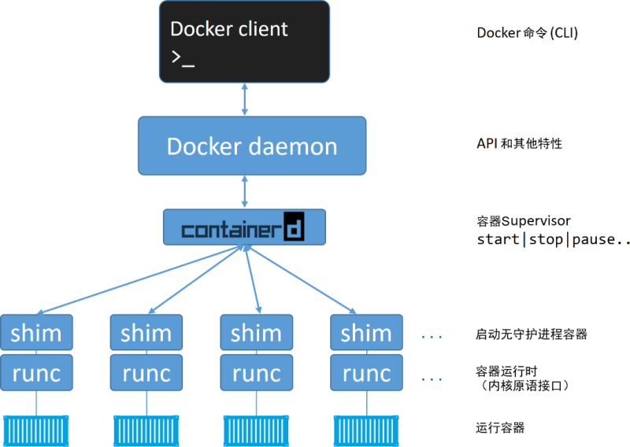

# Docker

> <font size=2>提示：“Docker”一词来自英国口语，意为码头工人（Dock Worker），即从船上装卸货物的人。Docker 引擎可以从 Docker 网站下载，也可以基于 GitHub 上的源码进行构建。无论是开源版本还是商业版本，都有 Linux 和 Windows 版本。Docker 引擎主要有两个版本：企业版（EE）和社区版（CE）。</font>
>
> ***docker安装方式***
>
> ​	-windos http://c.biancheng.net/view/3121.html
>
> ​	-mac	 http://c.biancheng.net/view/3122.html
>
> ​	-linux   http://c.biancheng.net/view/3124.html
>
> ​	-docker Engine引擎升级 http://c.biancheng.net/view/3127.html

>  <font size=2>Docker 引擎由许多专用的工具协同工作，从而可以创建和运行容器，例如 API、执行驱动、运行时、shim 进程等。</font>

>  <font size=2>Docker 引擎由如下主要的组件构成：Docker 客户端（Docker Client）、Docker 守护进程（Docker daemon）、containerd 以及 runc。它们共同负责容器的创建和运行。</font>

## <font size=2>**Docker 引擎的架构示意图**</font>

> ##### 


### 容器创建工具runc

+++

> <font size=2>runc 实质上是一个轻量级的、针对 Libcontainer 进行了包装的命令行交互工具（Libcontainer 取代了早期 Docker 架构中的 LXC）。runc 生来只有一个作用——创建容器，这一点它非常拿手，速度很快！不过它是一个 CLI 包装器，实质上就是一个独立的容器运行时工具。因此直接下载它或基于源码编译二进制文件，即可拥有一个全功能的 runc。但它只是一个基础工具，并不提供类似 Docker 引擎所拥有的丰富功能。</font>

### 容器管理工具containerd

+++

> <font size=2>在对 Docker daemon 的功能进行拆解后，所有的容器执行逻辑被重构到一个新的名为 containerd（发音为 container-dee）的工具中。它的主要任务是容器的生命周期管理——start | stop | pause | rm....containerd 在 Linux 和 Windows 中以 daemon 的方式运行，从 1.11 版本之后 Docker 就开始在 Linux 上使用它。Docker 引擎技术栈中，containerd 位于 daemon 和 runc 所在的 OCI 层之间。Kubernetes 也可以通过 cri-containerd 使用 containerd 如前所述，containerd 最初被设计为轻量级的小型工具，仅用于容器的生命周期管理。然而，随着时间的推移，它被赋予了更多的功能，比如镜像管理 其原因之一在于，这样便于在其他项目中使用它。比如，在 Kubernetes 中，containerd 就是一个很受欢迎的容器运行时。然而在 Kubernetes 这样的项目中，如果 containerd 能够完成一些诸如 push 和 pull 镜像这样的操作就更好了。因此，如今 containerd 还能够完成一些除容器生命周期管理之外的操作。不过，所有的额外功能都是模块化的、可选的，便于自行选择所需功能。 所以，Kubernetes 这样的项目在使用 containerd 时，可以仅包含所需的功能。</font>

### 解耦器shim

+++

> <font size=2>shim 是实现无 daemon 的容器（用于将运行中的容器与 daemon 解耦，以便进行 daemon 升级等操作）不可或缺的工具。前面提到，containerd 指挥 runc 来创建新容器。事实上，每次创建容器时它都会 fork 一个新的 runc 实例。不过，一旦容器创建完毕，对应的 runc 进程就会退出。因此，即使运行上百个容器，也无须保持上百个运行中的 runc 实例。一旦容器进程的父进程 runc 退出，相关联的 containerd-shim 进程就会成为容器的父进程。作为容器的父进程，shim 的部分职责如下。1.保持所有 STDIN 和 STDOUT 流是开启状态，从而当 daemon 重启的时候，容器不会因为管道（pipe）的关闭而终止。2.将容器的退出状态反馈给 daemon。</font>

### daemon 

+++

> <font size=2>当所有的执行逻辑和运行时代码都从 daemon 中剥离出来之后，问题出现了—— daemon 中还剩什么 显然，随着越来越多的功能从 daemon 中拆解出来并被模块化，这一问题的答案也会发生变化。不过，daemon 的主要功能包括镜像管理、镜像构建、REST API、身份验证、安全、核心网络以及编排。</font>

### 在 Linux 中的实现

+++

> <font size=2>在 Linux 系统中，前面谈到的组件由单独的二进制来实现，具体包括 dockerd(Docker  daemon)、docker-containerd(containerd)、docker-containerd-shim (shim) 和  docker-runc (runc)。通过在 Docker 宿主机的 Linux 系统中执行 ps 命令可以看到以上组件的进程。当然，有些进程只有在运行容器的时候才可见。</font>

## 启动一个新的容器

+++

```bash
docker run -itd contos:last /bin/bash
```

> <font size=2>当使用 Docker 命令行工具执行如上命令时，Docker 客户端会将其转换为合适的 API 格式，并发送到正确的 API 端点。API 是在 daemon 中实现的。这套功能丰富、基于版本的 REST API 已经成为 Docker 的标志，并且被行业接受成为事实上的容器 API。一旦 daemon 接收到创建新容器的命令，它就会向 containerd 发出调用。daemon 已经不再包含任何创建容器的代码了！daemon 使用一种 CRUD 风格的 API，通过 gRPC 与 containerd 进行通信。虽然名叫 containerd，但是它并不负责创建容器，而是指挥 runc 去做。containerd 将 Docker 镜像转换为 OCI bundle，并让 runc 基于此创建一个新的容器。然后，runc 与操作系统内核接口进行通信，基于所有必要的工具（Namespace、CGroup等）来创建容器。容器进程作为 runc 的子进程启动，启动完毕后，runc 将会退出。</font>
>
> **容器启动完毕。整个过程如下图所示**


#### 该模型优势


> <font size>将所有的用于启动、管理容器的逻辑和代码从 daemon 中移除，意味着容器运行时与 Docker daemon  是解耦的，有时称之为“无守护进程的容（daemonless container）”，如此，对 Docker daemon  的维护和升级工作不会影响到运行中的容器。</font>

##### <font size=4 color="gthnzxa">以centos安装为例子</font>

```bash
yum -y install docker
systemctl start docker
systemctl status docker
```


`安装成功`

<font size=2 color='bul'>**查看存储驱动类型**</font>

`docker info`


### <font color='gthnzxa'>docker镜像常用命令</font>

><font size=2>从运维的角度来说，我们需要掌握 [Docker](http://c.biancheng.net/docker/) 的镜像下载、运行新的容器、登录新容器、在容器内运行命令，以及销毁容器。 当我们安装 Docker 的时候，会涉及两个主要组件：Docker 客户端和 Docker daemon（有时也被称为“服务端”或者“引擎”） daemon 实现了 Docker 引擎的 API。使用 Linux 默认安装时，客户端与 daemon 之间的通信是通过本地 IPC/UNIX Socket  完成的（/var/run/docker.sock）；在 Windows 上是通过名为  npipe:////./pipe/docker_engine 的管道（pipe）完成的。</font>

```bash
docker version#检测客户端和服务端是否都已经成功运行，并且可以互相通信。
```

> Client:
>  Version:         1.13.1
>  API version:     1.26
>  Package version: docker-1.13.1-161.git64e9980.el7_8.x86_64
>  Go version:      go1.10.3
>  Git commit:      64e9980/1.13.1
>  Built:           Tue Apr 28 14:43:01 2020
>  OS/Arch:         linux/amd64
>
> Server:
>  Version:         1.13.1
>  API version:     1.26 (minimum version 1.12)
>  Package version: docker-1.13.1-161.git64e9980.el7_8.x86_64
>  Go version:      go1.10.3
>  Git commit:      64e9980/1.13.1
>  Built:           Tue Apr 28 14:43:01 2020
>  OS/Arch:         linux/amd64
>  Experimental:    false

```bash
docker search centos#查找镜像
docker  pull docker.io/centos #拉取镜像
docker images #查看镜像
dicker run -it centos:last /bin/bash #根据镜像启动容器
```

> 接下来分析一下` docker  run` 命令。`docker  run` 告诉 Docker daemon 启动新的容器。
>
> 其中 -it 参数告诉 Docker 开启容器的交互模式并将读者当前的 Shell 连接到容器终端。接下来，命令告诉 Docker，用户想基于  centos:latest 镜像启动容器（如果用户使用 Windows，则是基于 microsoft/powershell:nanoserver 镜像）。
>
>  最后，命令告诉 Docker，用户想要在容器内部运行哪个进程。对于 Linux 示例来说是运行 Bash Shell，对于 Windows 示例来说则是运行 PowerShell。
>
>  在容器内部运行`ps`命令查看当前正在运行的全部进程。

```bash
docker ps #查看所有运行的容器
docker ps -a #查看所有容器(包括停止的容器)
docker ps -l #查看最后一个创建的容器
docker exec -it **docker ID** /bin/bash#(进入容器)
ctrl +d #退出容器
docker stop docker ID #杀死容器
docker start docker #启动容器
```

### 更新镜像

+++


| 选项       | 说明         |
| ---------- | ------------ |
| REPOSITORY | 镜像仓库源   |
| TAG        | 镜像标签     |
| image id   | 镜像ID       |
| created    | 镜像创建时间 |
| SIze       | 大小         |

> <font size=2>同一仓库源可以有多个 TAG，代表这个仓库源的不同个版本，如ubuntu仓库源里，有15.10、14.04等多个不同的版本，我们使用 REPOSITORY:TAG 来定义不同的镜像。</font>

首先运行一个镜像

```bash
docker run  --name=web -d -p 1111:5000  training/webapp python app.py#运行一个镜像
docker ps -l -q
docker commit -m="test" -a="anxu" web web/nodejs:v1
```

| 参数          | 描述             |
| ------------- | ---------------- |
| -m            | 提交的描述信息   |
| -a            | 作者             |
| web           | 容器ID或容器名字 |
| web/nodejs:v1 | 要创建的镜像名字 |

```bash
docker images
```


### 设置镜像标签

+++

> 我们可以使用 docker tag 命令，为镜像添加一个新的标签。

```bash
docker tag e3b3fd976b9d web/nodejs:v2
```


> 可见e3b3fd976b9d有两个标签

### 启动一个web服务

+++

```bash
docker pull training/webapp#下载镜像
docker images#查看镜像	
docker run -d -P training/webapp python app.py#创建容器
	-P 把容器开放的端口映射到本机
	-d 后台运行
docker ps #查看容器信息
```


> 可见把容器的5000端口映射到了本机的1025端口
>
> 浏览器访问


```bash
docker stop 42ab#停止容器
docker rm 42ab#删除容器
docker run  --name=web -d -p 1111:5000  training/webapp python app.py
	-name 指定容器名字
	-p 本机端口:容器开放端口
```

```bash
docker ps 
```


> 可见NAMES 是 web
>
> 端口是5000映射到1111

```bash
docker logs web#查看标准输出
```


```bash
docker top web#查看web容器内的进程
```


```bash
docker inspect web #查看容器具体信息
```


## Docker 容器连接

### 网络端口映射

+++

创建一个nodejs容器

```bash
docker run -d -P training/webapp python app.py
docker ps -l
```

**可以使用-P随机也可以使用-p指定**

另外-p也可以指定IP


这样我们就可以通过访问 127.0.0.1:1112 来访问容器的 5000 端口。

上面的例子中，默认都是绑定 tcp 端口，如果要绑定 UDP 端口，可以在端口后面加上 /udp。

```bash
docker port web#查看端口映射信息
```

